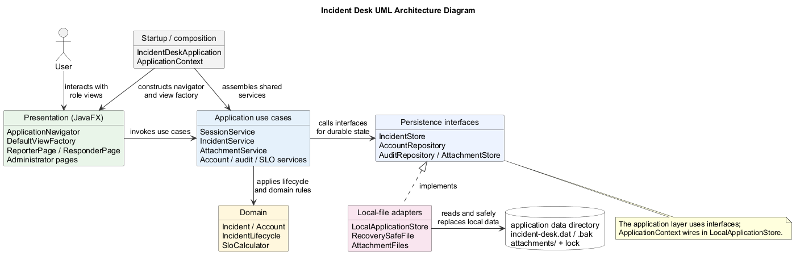
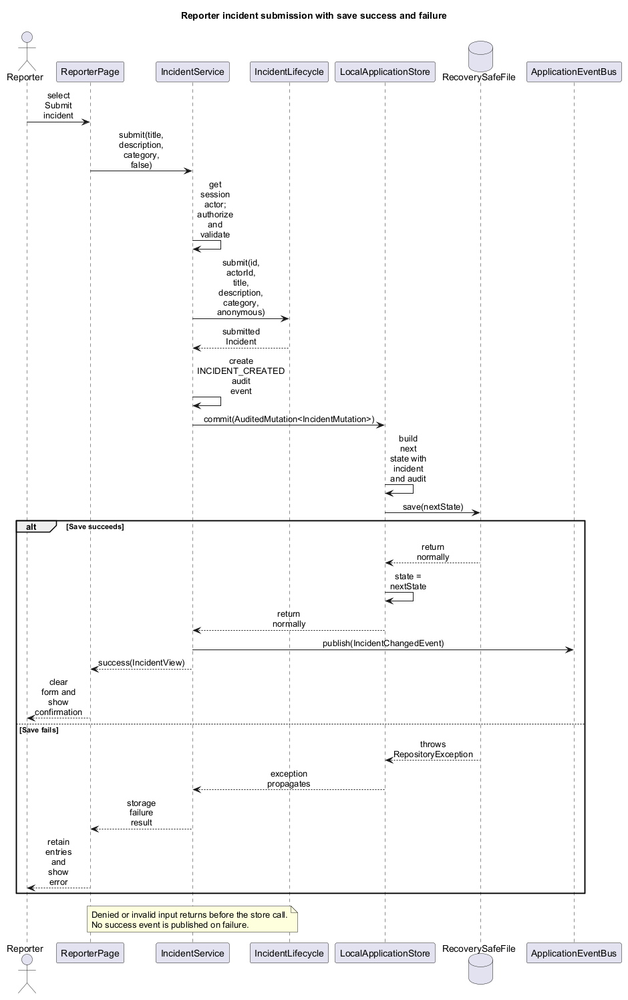

# Incident Desk Developer Guide

## Table of Contents

- [1. Introduction](#1-introduction)
- [2. Setting up](#2-setting-up)
- [3. Architecture](#3-architecture)
- [4. Design](#4-design)
- [5. Implementation](#5-implementation)
- [6. Design considerations](#6-design-considerations)
- [7. Development process and testing](#7-development-process-and-testing)
- [8. Instructions for manual testing](#8-instructions-for-manual-testing)
- [9. Acknowledgements](#9-acknowledgements)

## 1. Introduction

This guide is for developers building, testing, or extending Incident Desk. The
[User Guide](UserGuide.md) describes the current user-facing workflows. Incident
Desk is a single-process JavaFX desktop application with Reporter, Responder,
and Administrator roles. It uses local files, not a server or database. Some
application services support operations that the current authenticated UI does
not expose; the guides distinguish those from complete user workflows.

## 2. Setting up

### Prerequisites

- JDK 25. The application deliberately rejects every other Java feature
  version at startup so local and packaged behavior remains reproducible.
- Git. A separate Gradle installation is not required.

Confirm that `java -version` and `javac -version` both report version 25.

### Common commands

On Windows, run:

```powershell
.\gradlew.bat test
.\gradlew.bat check
.\gradlew.bat run
.\gradlew.bat previewAuthenticatedShell
.\gradlew.bat shadowJar
```

On macOS or Linux, replace `.\gradlew.bat` with `./gradlew`.

The executable Shadow JAR is written to `build/libs/incident-desk.jar`. It
contains JavaFX native libraries for Windows, macOS, and Linux, all x86_64.
JavaFX publishes separate, differently-architected natives for Apple Silicon
(`mac-aarch64`) and ARM Linux (`linux-aarch64`), but those natives share the
same file names as their x86_64 counterparts (e.g. `libglass.dylib`), so a
single jar cannot bundle both architectures for the same OS. Running the
packaged jar on Apple Silicon therefore requires an x86_64 (Rosetta) JVM.
Development compilation, tests, and `run` instead select JavaFX for the Gradle
JVM's OS and CPU architecture, including native Apple Silicon (`mac-aarch64`)
and ARM Linux (`linux-aarch64`). Use the same architecture for the Gradle JVM
and its JDK 25 toolchain. Windows development currently supports x86_64 only.
`verifyJavaFxPlatforms` (included in `check`) verifies dependency isolation;
building the Shadow JAR on ARM does not add ARM natives to that Intel-only JAR.

For native Apple Silicon packaging, run:

```sh
./gradlew shadowJarMacArm64
java -jar build/libs/incident-desk-mac-aarch64.jar
```

Use an ARM64 JDK 25 for that launch. This second JAR contains only macOS ARM64
JavaFX libraries and does not replace `incident-desk.jar`. `assemble` builds
both artifacts; `shadowJar` alone still builds only the original Intel artifact.
Each user needs just the one JAR matching their OS/JVM architecture.

`PackagedApplicationTest` checks both JARs' macOS binary headers and launches
the matching artifact with `java -jar`. A test-only observer agent waits for
the application window and requests normal shutdown. Neither the observer nor
test code ships in either application JAR. The process uses fresh temporary
application storage and a separate JavaFX cache. CI tests the packaged launch
on Linux/Windows x86_64, macOS x86_64, and macOS ARM64. Release jobs publish
each of the two filenames only once, avoiding merged-artifact overwrites.

`previewAuthenticatedShell` exercises the real login, session, role-routing,
shell, and logout path with in-memory administrator, reporter, and responder accounts:

```powershell
.\gradlew.bat previewAuthenticatedShell
```

The login names are `admin`, `reporter`, and `responder`; the preview accepts
any password for each account. These accounts and the test-only verifier exist
only in the preview process and are not written to application data or included
in production.

### Repository layout

`src/main/java/com/company/incidentdesk/` contains the production packages
below; `src/test/java/` mirrors them for JUnit tests. `docs/` contains this
guide, the User Guide, diagrams, and screenshots. `.agents/` holds the product
and engineering contracts, while `.github/workflows/` defines CI and release
jobs. Generated artifacts go under `build/` and are not source files.

## 3. Architecture



The diagram shows runtime collaboration. `ApplicationContext` assembles the
shared services and storage once; the JavaFX shell and views call those
services. Application services apply domain rules and use persistence
interfaces. `LocalApplicationStore` implements those interfaces and writes one
local aggregate file. Arrows indicate calls or wiring, not permission grants.

- `com.company.incidentdesk.domain`: domain types, incident lifecycle, and SLO
  calculations.
- `com.company.incidentdesk.application`: use cases and authenticated-session
  orchestration, including authorization policies.
- `com.company.incidentdesk.persistence`: local-file storage behind
  application-facing interfaces and their local-file implementation.
- `com.company.incidentdesk.ui`: JavaFX presentation code.
- `com.company.incidentdesk.startup`: runtime checks, configuration, and
  assembly. The file store acquires the process lock.

`ApplicationContext` assembles process-wide repositories and application
services once at startup. `ApplicationNavigator` owns the authentication
boundary and places every role dashboard inside the same `AuthenticatedShell`;
views receive their dependencies through `DefaultViewFactory` rather than
constructing services themselves.

Dependencies point inward: UI, persistence, and startup may depend on
application and domain code; domain code must not depend on those outer layers.

## 4. Design

### UI, session, and authorization

`ApplicationNavigator` switches between sign-in and the authenticated shell.
`DefaultViewFactory` constructs each role's dashboard and permitted detail
views from the services in `ApplicationContext`. A UI control being hidden is
not an access check: application services obtain the current account from the
session and recheck ownership, role, assignment, and responder category access
when an operation runs. Denied or missing incident access maps to a
presentation-safe unavailable result.

### Incident model and lifecycle

`IncidentLifecycle` owns the transitions among `DRAFT`, `SUBMITTED`,
`ASSIGNED`, `RESOLVED`, and `WITHDRAWN`. `IncidentService` combines lifecycle
operations with authorization, validation, audit creation, persistence, and
post-commit events. Handoff clears the assignee but preserves the queue key;
reopening starts a new queue cycle. The full transition contract is in
[`.agents/incident-lifecycle.md`](../.agents/incident-lifecycle.md).

### Runtime data

The packaged JAR and classpath resources are read-only. Runtime data,
attachments, backups, and diagnostics are resolved through one configurable
application-data directory. Tests that exercise persistence must use a fresh
temporary directory and must never use a real application-data directory.

`ApplicationDataDirectory` uses the `incidentdesk.dataDir` system property,
then `INCIDENT_DESK_DATA_DIR`, then `.incident-desk` under the user's home
directory. `LocalApplicationStore` holds accounts, credentials, incidents,
comments, audit records, promotion requests, SLO target versions, and
attachment metadata in `incident-desk.dat` (current schema version 1). It
holds `incident-desk.lock` while the app is open, so a second process cannot
write to the same directory.

`RecoverySafeFile` writes a validated temporary file, retains one
last-known-good `.bak` copy, and replaces the canonical file atomically where
the filesystem permits. Corrupt canonical data or an unsupported newer schema
stops startup; restoring a backup is an explicit action, not an automatic
reset. Attachment blobs live separately under the same data directory. See
[`.agents/persistence.md`](../.agents/persistence.md) for the intended recovery
contract, noting that its attachment-migration paragraph still describes an
older version-2 plan rather than the current version-1 implementation.

## 5. Implementation

### Incident submission and atomic audit



`ReporterPage` submits the form asynchronously through
`IncidentService.submit(...)`, passing `anonymous=false` in the current UI.
The service derives the actor from the active session, authorizes submission,
validates required content, and asks `IncidentLifecycle` to create a submitted
incident. It builds an `INCIDENT_CREATED` audit event and calls
`IncidentStore.commit(new AuditedMutation<>(...))`. The local store constructs
the next state with both the incident and audit event, saves it, and only then
replaces its in-memory state. `IncidentChangedEvent` is published after the
commit returns. If validation, authorization, or storage fails, the UI shows a
failure and retains the form entries; no success event is published.

### Responder dashboard integration (#37)

`ResponderPage` accepts the shared `IncidentService`, an
`IncidentPresentationMapper` using the same authorization/session source, the
`SessionProvider`, and an incident-ID detail callback. It reads
authorized eligible and assigned queues asynchronously, in deterministic queue
order. Refresh and navigation recheck the session and current category access;
detaching the page clears its contents and invalidates outstanding reads.

The reusable `IncidentTable` from #20 is shared with the component showcase and
consumes only privacy-safe `IncidentRowModel` values. The dashboard displays
queue-entry timestamps and keeps application queue ordering. The authenticated
Responder dashboard does not currently expose filters, interactive sorting, or
an SLO column.

`DefaultViewFactory` now supplies the authenticated services and detail
callback, and `ResponderIncidentPage` handles claim, resolution, and handoff.
Dashboard reads do not modify persisted data, audit records, or SLO timestamps,
and require no migration or additional production dependency. The separate
test-only shell preview uses in-memory accounts, not production data.

### Shared attachments (#15)

Use `ApplicationContext.attachments()` for application operations and compose
`AttachmentPane(service, savedIncidentId)` into a page. The pane reuses the
shared panel, attachment tile, action, and feedback components. It performs
file reads off the JavaFX thread and owns an `AttachmentViewer`; close it on
navigation if it is not detached from its scene. The viewer clears content
when the authenticated session or incident permission snapshot changes.
The pane must receive a persisted incident; saving a new draft/submission and
attaching selected files is a separate, explicit sequence. The pane is now
composed into Administrator and Responder incident-detail pages. The current
Reporter dashboard has no incident-detail route, so upload is not an
end-to-end Reporter UI workflow yet.

`AttachmentService.list/add/open` enforce current incident authorization.
Only the owning reporter can add files while a draft or an unassigned submitted
incident is editable. An upload does not change lifecycle or SLO timestamps.
Successful additions commit metadata and `ATTACHMENT_ADDED` evidence together.
Anonymous display models use generic names and do not contain local paths.
The internal `AttachmentRead` capability rechecks authorization before exposing
image bytes; it does not expose a storage URI.

Attachments are image-only: PNG/JPEG ≤10 MiB,
5 files/100 MiB per incident, and 40 million decoded image pixels. Inject an
`AttachmentLimits` value when constructing the service to change the limits.
The UI help text comes from `AttachmentService.uploadLimitSummary()` and
reflects those configured limits without rounding byte bounds. Videos and audio
are rejected even if renamed as an image. Images are decoded from memory;
the app does not use JavaFX media or launch an external viewer.
Original content and embedded metadata are preserved, so the uploader warns
that media can disclose identity despite generic anonymous filenames.

Storage uses generated UUID filenames with validated extensions beneath the
configured application-data directory. The current aggregate schema remains
version 1, including attachment metadata. Successful saves retain the previous
canonical file as a bounded backup; there is no version-2 migration in this
implementation.
Pending-upload markers support restart cleanup without sweeping unrelated
files. See `.agents/persistence.md` for the write/recovery protocol. Development
tests use temporary directories and do not migrate real application data.

Run `./gradlew test --tests '*Attachment*Test'` on macOS/Linux, or the equivalent
`gradlew.bat` command on Windows. The tiny original H.264 fixture is retained
only for rejection tests, never played. CI keeps the Linux full build and
Windows/macOS attachment tests, with no native media codec requirement.
No data migration is needed for this policy change. Source tests alone do not
replace the packaged-application startup test or manual GUI inspection.

## 6. Design considerations

The app deliberately runs in one desktop process with a local aggregate file.
This avoids a database or server for the current scope, but does not provide
multi-computer synchronization or concurrent writers to one data directory.
The process lock rejects a second writer; a backup and validated replacement
reduce the risk of a partial save. The trade-off is that each logical mutation
rewrites the aggregate rather than a small database row.

Authorization belongs in application operations because a hidden button cannot
protect a service call, and category access can change after a list was loaded.
Audit evidence is included in the same store commit as an incident change;
notifications are published after that commit and are in-memory only. Domain
timestamps are UTC instants, while the presentation mapper formats them in the
local time zone. See [the authorization matrix](../.agents/authorization-matrix.md),
[audit policy](../.agents/audit-policy.md), and [SLO definitions](../.agents/slo.md)
for the detailed rules.

## 7. Development process and testing

### Testing and quality checks

JUnit tests belong under `src/test/java` and should mirror the production
package layout. Use deterministic clocks and identifier generators for domain
tests. Test both allowed and denied operations at the domain boundary.

`./gradlew check` runs tests, `verifyShadowJar`, and
`verifyJavaFxPlatforms`; the build does not currently apply a Checkstyle
plugin. The Linux CI job runs `build` under Xvfb. Additional Windows and macOS
jobs run attachment, startup, and packaged-application tests. These checks do
not replace an interactive GUI check on the intended platform. A change is
ready for review only after the relevant checks pass and its data,
authorization, audit, privacy, and SLO effects have been considered.

### Change workflow

Start from the relevant `.agents/` contract and a focused issue. Work on a
branch, keep commits reviewable, run the affected tests and `check`, then open
a pull request for review. Update the User Guide when observable behavior
changes and this guide when design or engineering decisions change. CI runs on
pushes and pull requests to `main` and `develop`; the release workflow runs on
version tags. Record checks actually run, not checks merely expected to pass.

### Adding dependencies

Production dependencies require team approval. Record why a dependency is
needed, prefer a maintained library with a narrow purpose, pin its version, and
verify its license before adding it.

## 8. Instructions for manual testing

Use a disposable directory through `INCIDENT_DESK_DATA_DIR`, not a real user's
data. Follow the [User Guide's end-to-end scenario](UserGuide.md): register one
account of each role, submit a Facilities incident as Reporter, grant the
Responder Facilities access as Administrator, then claim and resolve it as
Responder. Return as Administrator to inspect the incident, statistics, and
audit log. Restart against the same test directory to confirm persistence.
Record the OS, JDK version, launch command, observed result, and any failures.
Do not claim GUI behavior on an OS that has not been checked interactively.

## 9. Acknowledgements

The guide's organization and choice of architecture and sequence diagrams were
informed by the [Possession Manager Developer Guide](https://github.com/haowern98/CS3227-2610-MP1/blob/master/docs/DeveloperGuide.md).
The diagram style, including the Arial font and PlantUML settings, follows its
[architecture source](https://github.com/haowern98/CS3227-2610-MP1/blob/master/docs/diagrams/architecture.puml)
and [sequence source](https://github.com/haowern98/CS3227-2610-MP1/blob/master/docs/diagrams/persistent-change-sequence.puml).
The Incident Desk diagrams have different participants and relationships to
match this project's code. They were rendered with [PlantUML](https://plantuml.com/).
The project uses [JavaFX](https://openjfx.io/) for its desktop UI,
[Gradle](https://gradle.org/) and the [Shadow plugin](https://gradleup.com/shadow/)
for builds and packaging, [JUnit 5](https://junit.org/junit5/) for tests, and
[GitHub Actions](https://docs.github.com/en/actions) for CI and releases.
Contributors should add any further reused ideas, code, assets, or documentation
they know of before submission.

### Product references

The canonical requirements are in `.agents/`. Read the applicable lifecycle,
authorization, anonymity, audit, persistence, SLO, and testing documents before
changing related behavior.
