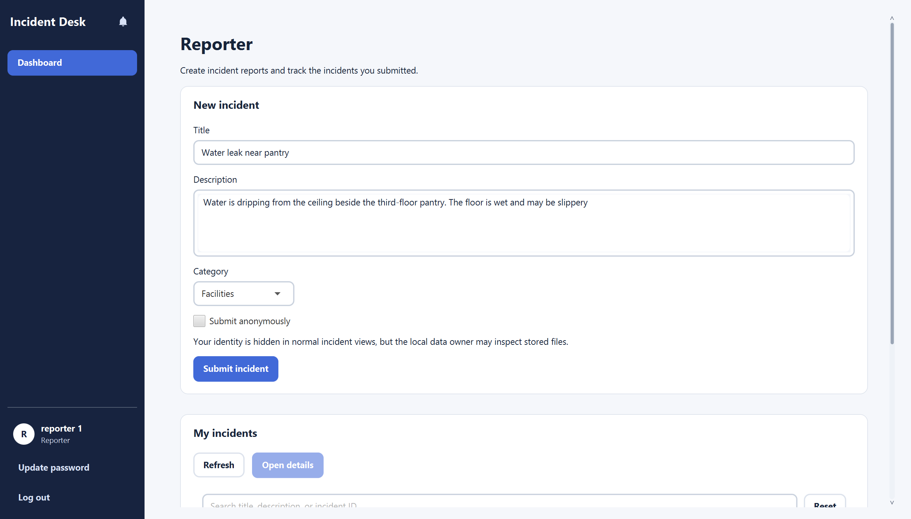
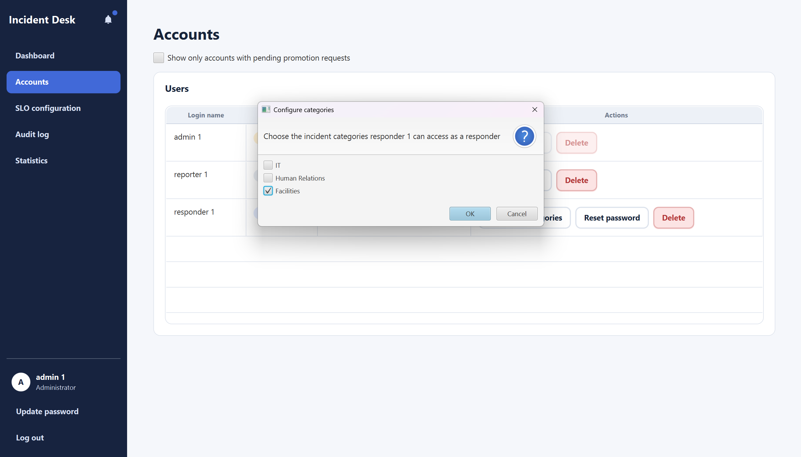

# Incident Desk User Guide

## Table of Contents

- **[Overview](#overview)**
- **[Quick start](#quick-start)**
  - [Install and open Incident Desk](#install-and-open-incident-desk)
  - [Register and sign in](#register-and-sign-in)
  - [Account controls and notifications](#account-controls-and-notifications)
- **[Reporter: submit an incident](#reporter-submit-an-incident)**
- **[Administrator: set up responder access and manage accounts](#administrator-set-up-responder-access-and-manage-accounts)**
- **[Responder: handle an incident](#responder-handle-an-incident)**
  - [Claim and resolve an incident](#claim-and-resolve-an-incident)
  - [Hand off an incident](#hand-off-an-incident)
- **[Administrator: manage incidents](#administrator-manage-incidents)**
- **[Administrator: SLOs, statistics, and audit log](#administrator-slos-statistics-and-audit-log)**
  - [Configure SLO targets](#configure-slo-targets)
  - [Review statistics](#review-statistics)
  - [Review application activity](#review-application-activity)
- **[Incident details, comments, and attachments](#incident-details-comments-and-attachments)**
- **[Data storage and current limitations](#data-storage-and-current-limitations)**
- **[Planned improvements](#planned-improvements)**

---

## Overview

Incident Desk is a desktop app for reporting and handling company incidents. It has three account types:

- **Reporters** submit incidents.
- **Responders** handle incidents in categories assigned to them.
- **Administrators** oversee incidents, accounts, service-level objectives (SLOs), statistics, and audit records.

Only one account can be signed in at a time. Use the section for your account type, or follow the guide from start to finish to see how an incident moves from submission to resolution.

If you are exploring the app, use fictional information because incident text and attachments are stored on your computer.

---

## Quick start

### Install and open Incident Desk

Before you begin, make sure Java 25 is installed. You can check your version by opening a terminal and entering:

```text
java -version
```

The version shown should begin with `25`. If it does not, install Java 25 before continuing.

To open the app:

1. Download the Incident Desk JAR file provided for your computer.
2. Move it to a folder where you want to keep the app.
3. Open a terminal in that folder.
4. Enter `java -jar incident-desk.jar`. If your downloaded file has a different name, use that filename instead.
5. Wait for the window titled **Incident Desk** to appear.

On an Apple Silicon Mac, use the macOS ARM64 JAR supplied with the release. Keep the JAR in place after opening it; your accounts and incidents are saved separately and remain available the next time you start the app.

### Register and sign in

1. On the sign-in screen, select **Register**.
2. Enter a non-blank, case-sensitive login name and a password, choose **Reporter**, **Responder**, or **Admin**, then select **OK**. The app confirms when the account has been created.
3. Enter that login name and password on the sign-in screen and select **Sign in**.

There are no built-in production accounts. For the end-to-end test in this guide, register one account of each type. A newly registered Responder has no category access; an Administrator must grant it in **Accounts** before that Responder can see eligible incidents. Registering an Admin account is currently available from the same **Register** dialog.

After signing in, use **Dashboard** to return to your role's main page. Administrators also see **Accounts**, **SLO configuration**, **Audit log**, and **Statistics** in the navigation.

### Account controls and notifications

Select **Update password** under your account name to enter your current password, a new password, and the same new password again. Select **Update password** in the dialog to save it. An incorrect current password, blank new password, or mismatched confirmation shows an error. After an Administrator resets your password, sign in with the temporary password and replace it in the required dialog before continuing.

Select the bell icon to open your notifications. Its badge shows the number you have not seen yet; opening the tray marks the displayed notifications as seen. These notifications are available only during the current app session, not after a restart. Select **Log out** when you want to switch accounts or finish using the app.

---

## Reporter: submit an incident

Sign in as a Reporter. The **Dashboard** shows a **New incident** form and a **My incidents** list:

1. Enter a **Title** and **Description**, and choose a **Category**: IT, Human Relations, or Facilities.
2. Select **Submit incident**. Wait for **Incident submitted** and **Your report has been saved.** The form clears after a successful submission.

For example, enter **Title:** `Water leak near pantry`, **Description:** `Water is dripping from the ceiling beside the third-floor pantry. The floor is wet and may be slippery.`, and **Category:** Facilities. An Administrator and a Responder with Facilities access can then manage this incident.



All three fields are required. If one is empty, the form highlights it and does not submit the incident. If saving fails, the app reports that the incident was not saved; your entries remain in the form so you can try again.

Use **My incidents** to track reports you submitted. Select **Refresh** to reload the list, then select a row and choose **Open details** (or double-click the row) to inspect that incident. The list shows its current status. The detail page provides the actions available for that incident's current state; see [Incident details, comments, and attachments](#incident-details-comments-and-attachments).

Drafts, anonymous submission, and promotion requests are not available in the current Reporter UI. Reporter attachment support is limited to PNG/JPEG images; video and audio are not supported. Do not use the **Sample UI** preview to test or infer these workflows.

---

## Administrator: set up responder access and manage accounts

Sign in as an Admin and select **Accounts** to see login names, roles, responder categories, and available actions. To enable the example Responder to handle a Facilities incident, find that account, select **Configure categories**, tick **Facilities**, then confirm with **OK**. Log out and sign in as the Responder; the Facilities incident should now appear in **Eligible queue**.



Other account actions are:

- **Reset password**: confirm the reset. A one-time temporary password is displayed once and expires after 24 hours. Pass it to the account holder securely; they must replace it after signing in. Do not include it in screenshots or bug reports.
- **Delete**: confirm to disable that account's login. Its incident and audit history is retained. This cannot be undone in the current UI; use only a disposable test account when testing it.

---

## Responder: handle an incident

A Responder sees only incidents in categories granted by an Administrator. Complete the account setup above before looking for the Facilities example. If the dashboard is still empty, check that the account has Facilities access and select **Refresh**.

The Responder **Dashboard** has two lists: **Eligible queue** for unassigned incidents you can claim, and **My assigned incidents** for incidents already assigned to you. Select an incident and choose **Open details**, or double-click its row. Use **Refresh** to reload the lists.


### Claim and resolve an incident

1. Open the `Water leak near pantry` incident from **Eligible queue** and select **Claim**. The app confirms the claim. Select **Back to dashboard**; the incident should now appear under **My assigned incidents**.
2. Open it again and select **Resolve**. Enter non-blank **Resolution remarks**, such as `The leak was isolated and the ceiling was repaired.`, then select **Confirm resolution**. Empty remarks are rejected.
3. After a successful resolution, the app returns to the dashboard. The incident no longer appears in the Responder's active queues. An Administrator can still inspect it and its resolution history.

### Hand off an incident

If you need to return a claimed incident to the category queue, open its details, select **Hand off**, and confirm. The incident is unassigned and becomes eligible for another authorized Responder to claim. You can cancel the confirmation without changing the incident.

The current Responder lists do not offer search, filters, sorting, an **In Progress** action, or personal statistics.

---

## Administrator: manage incidents

Sign in as an Admin. **Dashboard** shows an SLO overview and an **Incidents** table across the company. Use the search box to look for words in a title or description, or an incident ID. The filters include category, status, assignment, reporter, responder, creation dates, and SLO state. You can also choose a sort field and direction; **Reset** restores the default view. Double-click an incident row, or select it and press Enter, to open its details. **Back to dashboard** returns to the list.


The detail view shows the incident description, category and status, reporter and assignee labels, timestamps, resolution history, comments, attachments, and an SLO indicator. Available action buttons depend on the incident's current state:

- **Assign** an unassigned submitted incident, or **Reassign** an assigned one: choose an enabled Responder with access to that incident's category, then select **Confirm reassignment**. If no such Responder exists, the app says so; grant category access under **Accounts** first.
- **Unassign** an assigned incident: confirm to return it to its category queue.
- **Resolve** an assigned incident: enter non-blank **Resolution remarks** and select **Confirm resolution**. An Administrator can review the saved remarks in **Resolution history**.

The incident detail has an **Audit timeline** placeholder, not a working per-incident audit timeline. Use the separate **Audit log** page for application activity.

---

## Administrator: SLOs, statistics, and audit log

### Configure SLO targets

Select **SLO configuration**, then choose an incident category. The page shows its current effective target and configuration history. Enter all three target values and select **Save new target version**:

| Field | Enter |
| --- | --- |
| Average time to claim (minutes) | A non-negative whole number of minutes |
| Average time in progress (minutes) | A non-negative whole number of minutes |
| Average reopen rate (%) | A number from 0 to 100 |

For a simple test, select **Facilities** and enter `60`, `240`, and `10`. A successful save creates a new effective version in the history. New target versions apply prospectively; they do not rewrite historical compliance. Invalid values show a validation message and are not saved.

### Review statistics

Select **Statistics** to see a company summary and a Responder breakdown. You can filter by category and **Period from**/**Period through** dates. The summary includes incidents resolved, average time to claim, average time in progress, reopen rate, and Administrator-resolved count. The Responder table shows resolution-related measures per Responder; time to claim is queue performance and is not assigned to a particular Responder. If no incidents match the filters, the summary says so instead of inventing results.

### Review application activity

Select **Audit log** to view recorded security-sensitive and incident-changing activity. Each row shows its time, event ID, actor, event description, and outcome. Double-click a row to open **Audit event details**, including the action, target, outcome, and recorded changes. This is an application-level audit log; the incident detail's **Audit timeline** placeholder does not display these entries.

---

## Incident details, comments, and attachments

Reporters can open their own incidents from **My incidents**; Administrators can open incidents from their dashboard; Responders can open incidents from their eligible or assigned lists. The detail page displays the latest information their account is allowed to see. Select **Back to dashboard** to return to the list. If an incident or your access changes while the page is open, it may show **Incident unavailable**; return to the dashboard and refresh.

In **Comments**, enter a non-blank message and select **Add comment**. A successful comment appears in the thread. The text remains in the box if sending fails so you can try again. The **Resolution history** shows saved resolution remarks, while the **Service-level objective** panel shows the incident's SLO indicator.

For a Reporter-owned incident that is still **Submitted** and unassigned, the detail page offers **Edit** and **Withdraw**. **Edit** opens the existing title, description, and category so you can correct them; select **Save changes** to submit the update or **Cancel** to discard it. **Withdraw** asks for confirmation before cancelling the report. These actions are unavailable after a Responder claims the incident. The application checks ownership and incident state when saving. If the incident changes while the page is open, the detail reloads; if it remains viewable but is no longer editable, your unsaved values stay visible as read-only until you select **Cancel**. If the incident or your access is no longer available, the page shows **Incident unavailable**. Return to **My incidents** and refresh to reopen the latest details.

For one of your **Resolved** incidents, select **Reopen**, enter a non-blank **Follow-up explanation**, and select **Submit follow-up**. The explanation is added to the incident thread and the incident is reopened for further work. This is different from **Add comment**, which adds a comment without reopening the incident. If the explanation is blank, correct it and try again. If saving fails, the explanation is preserved so you can retry. If the incident's state or your access changed, the detail reloads; if it remains viewable but reopening is no longer available, the explanation stays read-only until you select **Cancel**. If the incident or your access is no longer available, the page shows **Incident unavailable** and clears the form.

The **Attachments** panel can list and display authorized PNG and JPEG images attached to an incident. For a saved Reporter-owned incident that is still editable and unassigned, select **Add attachment** and choose a PNG or JPEG image. Select **View attachment** on an entry to open it in the in-app image viewer. The application checks the incident's ownership and state when adding or viewing a file; if the incident is no longer editable, upload is unavailable or rejected. Video and audio uploads or playback are not supported.

---

## Data storage and current limitations

Accounts, incidents, comments, audit entries, SLO targets, and supported attachments are saved in the selected local data directory and remain available after a normal restart. Keep that directory if you want to retain your test records. Do not manually edit its files. Only one Incident Desk process can use a data directory at a time; close the first window before launching another against the same directory. The app is local and does not synchronize data between computers.

The notification bell shows in-session notifications, but its inbox does not persist across restarts. The current authenticated UI does not support Reporter drafts, anonymous submission, or a Reporter promotion-request form. Attachments are limited to PNG/JPEG images; video and audio uploads or playback are unsupported. The UI also lacks an **In Progress** action and Responder personal statistics. Some underlying services or the separate Sample UI preview contain other ideas; they are not end-to-end user workflows in this release.

To explore the complete workflow, register one account of each type. Submit the Facilities example as a Reporter, grant Facilities access to the Responder from the Administrator's **Accounts** page, and then claim and resolve the incident as the Responder. Finally, sign in as the Administrator to review the incident in **Dashboard**, **Statistics**, and **Audit log**.

---

## Planned improvements

- **Responder promotion requests:** Reporters cannot currently request promotion to Responder through the app. A future improvement will allow Reporters to submit a request for an Administrator to review and approve or reject.
