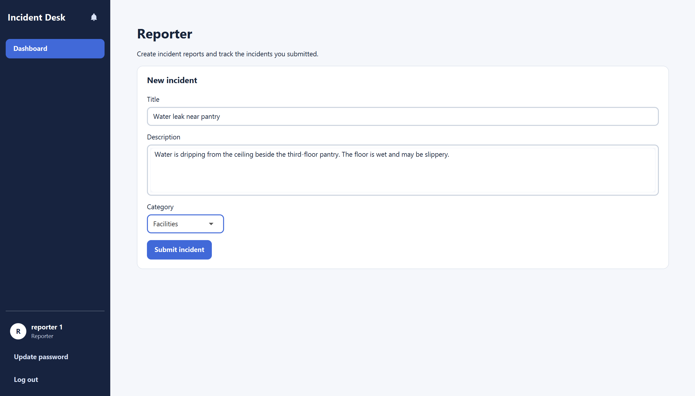
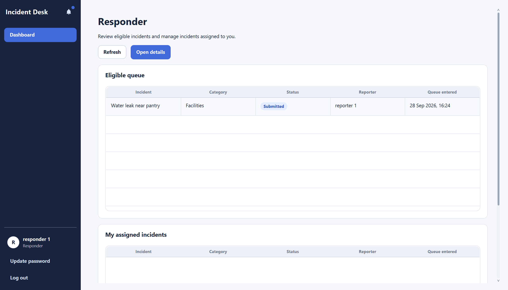
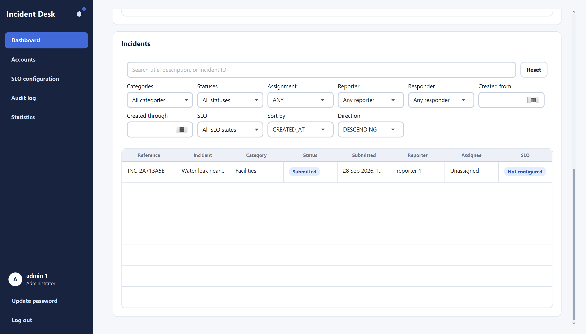

# Incident Desk User Guide

Incident Desk is a local desktop app for reporting and handling company incidents. It has three account types: Reporters submit incidents, Responders handle incidents in categories they can access, and Administrators oversee incidents and accounts. Only one account is signed in at a time.

This guide describes the current application, not the separate **Sample UI** preview shown on the sign-in screen. Use fictional information when testing; incident text and attachments are stored on your computer.

## Getting started

You need JDK 25. Check that both `java -version` and `javac -version` report version 25. Other Java versions are rejected at startup. From the repository root, launch the app with the checked-in Gradle wrapper:

```powershell
# Windows
.\gradlew.bat run
```

```sh
# macOS or Linux
./gradlew run
```

You do not need to install Gradle separately. The app opens a window titled **Incident Desk**. If you build the executable JAR instead, run `./gradlew shadowJar` (or `.\gradlew.bat shadowJar` on Windows), then `java -jar build/libs/incident-desk.jar`. That JAR supports x86_64 Windows, Linux, and macOS. On an Apple Silicon Mac using an ARM64 JDK 25, build with `./gradlew shadowJarMacArm64` and run `java -jar build/libs/incident-desk-mac-aarch64.jar` instead.

The app saves accounts and incidents in a local data directory. By default this is `.incident-desk` under your home directory. To keep peer-test data separate, set `INCIDENT_DESK_DATA_DIR` to a new directory **before** launching the app. For example, in PowerShell:

```powershell
$env:INCIDENT_DESK_DATA_DIR = Join-Path $env:TEMP 'incident-desk-peer-test'
.\gradlew.bat run
```

On macOS or Linux, you can use `INCIDENT_DESK_DATA_DIR="$HOME/incident-desk-peer-test" ./gradlew run`. Reuse the same directory to check that data survives a restart. Do not point it at a directory containing data you need to keep private from testers.

### Register and sign in

1. On the sign-in screen, select **Register**.
2. Enter a non-blank, case-sensitive login name and a password, choose **Reporter**, **Responder**, or **Admin**, then select **OK**. The app confirms when the account has been created.
3. Enter that login name and password on the sign-in screen and select **Sign in**.

There are no built-in production accounts. For the end-to-end test in this guide, register one account of each type. A newly registered Responder has no category access; an Administrator must grant it in **Accounts** before that Responder can see eligible incidents. Registering an Admin account is currently available from the same **Register** dialog.

After signing in, use **Dashboard** to return to your role's main page. Administrators also see **Accounts**, **SLO configuration**, **Audit log**, and **Statistics** in the navigation.

### Account controls and notifications

Select **Update password** under your account name to enter your current password, a new password, and the same new password again. Select **Update password** in the dialog to save it. An incorrect current password, blank new password, or mismatched confirmation shows an error. After an Administrator resets your password, sign in with the temporary password and replace it in the required dialog before continuing.

Select the bell icon to open your notifications. Its badge shows the number you have not seen yet; opening the tray marks the displayed notifications as seen. These notifications are available only during the current app session, not after a restart. Select **Log out** when you want to switch accounts or finish using the app.

## Reporter: submit an incident

Sign in as a Reporter. The **Dashboard** shows a **New incident** form:

1. Enter a **Title** and **Description**, and choose a **Category**: IT, Human Relations, or Facilities.
2. Select **Submit incident**. Wait for **Incident submitted** and **Your report has been saved.** The form clears after a successful submission.

For a peer test, try **Title:** `Water leak near pantry`, **Description:** `Water is dripping from the ceiling beside the third-floor pantry. The floor is wet and may be slippery.`, and **Category:** Facilities. The Administrator and a Responder with Facilities access can then use this incident in the following sections.



All three fields are required. If one is empty, the form highlights it and does not submit the incident. If saving fails, the app reports that the incident was not saved; your entries remain in the form so you can try again.

The current Reporter dashboard has only the submission form. It does not provide a Reporter incident list or a route to incident details. Drafts, anonymous submission, editing, withdrawal, reopening, promotion requests, and adding attachments from this dashboard are not available in the current UI. Do not use the **Sample UI** preview to test or infer these workflows.

## Administrator: set up responder access and manage accounts

Sign in as an Admin and select **Accounts** to see login names, roles, responder categories, and available actions. To enable the example Responder to handle a Facilities incident, find that account, select **Configure categories**, tick **Facilities**, then confirm with **OK**. Log out and sign in as the Responder; the Facilities incident should now appear in **Eligible queue**.


Other account actions are:

- **Reset password**: confirm the reset. A one-time temporary password is displayed once and expires after 24 hours. Pass it to the account holder securely; they must replace it after signing in. Do not include it in screenshots or bug reports.
- **Delete**: confirm to disable that account's login. Its incident and audit history is retained. This cannot be undone in the current UI; use only a disposable test account when testing it.
- **View request**: appears only on accounts with a pending Responder promotion request. The dialog shows requested categories and comments, with **Approve** and **Reject** choices. The current Reporter UI has no way to create such a request, so a fresh installation will not offer this action.

The **Show only accounts with pending promotion requests** checkbox narrows the account table to those requests. Actions that are not allowed for an account are disabled or absent.

## Responder: handle an incident

A Responder sees only incidents in categories granted by an Administrator. Complete the account setup above before looking for the Facilities example. If the dashboard is still empty, check that the account has Facilities access and select **Refresh**.

The Responder **Dashboard** has two lists: **Eligible queue** for unassigned incidents you can claim, and **My assigned incidents** for incidents already assigned to you. Select an incident and choose **Open details**, or double-click its row. Use **Refresh** to reload the lists.



### Claim and resolve

1. Open the `Water leak near pantry` incident from **Eligible queue** and select **Claim**. The app confirms the claim. Select **Back to dashboard**; the incident should now appear under **My assigned incidents**.
2. Open it again and select **Resolve**. Enter non-blank **Resolution remarks**, such as `The leak was isolated and the ceiling was repaired.`, then select **Confirm resolution**. Empty remarks are rejected.
3. After a successful resolution, the app returns to the dashboard. The incident no longer appears in the Responder's active queues. An Administrator can still inspect it and its resolution history.

If you need to return a claimed incident to the category queue instead, open its details, select **Hand off**, and confirm. The incident is unassigned and becomes eligible for another authorized Responder to claim. You can cancel the confirmation without changing the incident.

The current Responder lists do not offer search, filters, sorting, an **In Progress** action, or personal statistics. Those controls may appear in the Sample UI preview, but they are not part of this authenticated workflow.

## Administrator: manage incidents

Sign in as an Admin. **Dashboard** shows an SLO overview and an **Incidents** table across the company. Use the search box to look for words in a title or description, or an incident ID. The filters include category, status, assignment, reporter, responder, creation dates, and SLO state. You can also choose a sort field and direction; **Reset** restores the default view. Double-click an incident row, or select it and press Enter, to open its details. **Back to dashboard** returns to the list.



The detail view shows the incident description, category and status, reporter and assignee labels, timestamps, resolution history, comments, attachments, and an SLO indicator. Available action buttons depend on the incident's current state:

- **Assign** an unassigned submitted incident, or **Reassign** an assigned one: choose an enabled Responder with access to that incident's category, then select **Confirm reassignment**. If no such Responder exists, the app says so; grant category access under **Accounts** first.
- **Unassign** an assigned incident: confirm to return it to its category queue.
- **Resolve** an assigned incident: enter non-blank **Resolution remarks** and select **Confirm resolution**. An Administrator can review the saved remarks in **Resolution history**.

The incident detail has an **Audit timeline** placeholder, not a working per-incident audit timeline. Use the separate **Audit log** page for application activity.

## Administrator: SLOs, statistics, and audit log

### Configure SLO targets

Select **SLO configuration**, then choose an incident category. The page shows its current effective target and configuration history. Enter all three target values and select **Save new target version**:

| Field | Enter |
| --- | --- |
| Average time to claim (minutes) | A non-negative whole number of minutes |
| Average time in progress (minutes) | A non-negative whole number of minutes |
| Average reopen rate (%) | A number from 0 to 100 |

For a simple test, select **Facilities** and enter `60`, `240`, and `10`. A successful save creates a new effective version in the history. New target versions apply prospectively; they do not rewrite historical compliance. Invalid values show a validation message and are not saved.

### Review statistics

Select **Statistics** to see a company summary and a Responder breakdown. You can filter by category and **Period from**/**Period through** dates. The summary includes incidents resolved, average time to claim, average time in progress, reopen rate, and Administrator-resolved count. The Responder table shows resolution-related measures per Responder; time to claim is queue performance and is not assigned to a particular Responder. If no incidents match the filters, the summary says so instead of inventing results.

### Review application activity

Select **Audit log** to view recorded security-sensitive and incident-changing activity. Each row shows its time, event ID, actor, event description, and outcome. Double-click a row to open **Audit event details**, including the action, target, outcome, and recorded changes. This is an application-level audit log; the incident detail's **Audit timeline** placeholder does not display these entries.

## Incident details and comments

Administrators can open incidents from their dashboard; Responders can open incidents from their eligible or assigned lists. The detail page displays the latest information their account is allowed to see. Select **Back to dashboard** to return to the list. If an incident or your access changes while the page is open, it may show **Incident unavailable**; return to the dashboard and refresh.

In **Comments**, enter a non-blank message and select **Add comment**. A successful comment appears in the thread. The text remains in the box if sending fails so you can try again. The **Resolution history** shows saved resolution remarks, while the **Service-level objective** panel shows the incident's SLO indicator.

The **Attachments** panel can list and display authorized PNG and JPEG images already attached to an incident. Select **View attachment** on an entry to open its in-app image viewer. The underlying **Add attachment** control is enabled only for a Reporter who can still edit that incident, but the current Reporter dashboard has no way to open incident details. Consequently, a peer tester cannot upload a new attachment through the current UI. Videos are not supported by the image viewer.

## Local data and current limitations

Accounts, incidents, comments, audit entries, SLO targets, and supported attachments are saved in the selected local data directory and remain available after a normal restart. Keep that directory if you want to retain your test records. Do not manually edit its files. Only one Incident Desk process can use a data directory at a time; close the first window before launching another against the same directory. The app is local and does not synchronize data between computers.

The notification bell shows in-session notifications, but its inbox does not persist across restarts. The current authenticated UI also lacks a Reporter incident list/details, Reporter edit or withdrawal, anonymous or draft submission, Reporter follow-up/reopening, a Reporter promotion-request form, attachment upload access from the Reporter screen, an **In Progress** action, and Responder personal statistics. Some underlying services or the separate Sample UI preview contain parts of these ideas; they are not end-to-end user workflows in this release.

For a short end-to-end check: register the three account types in the same test data directory, submit the Facilities example as Reporter, grant Facilities access to the Responder under the Admin **Accounts** page, claim and resolve the incident as Responder, then review it in the Admin **Dashboard**, **Statistics**, and **Audit log**. Close and relaunch the app with the same data directory to check that the incident and accounts remain. The guide's steps describe expected behavior; report any difference you observe as a possible bug.
