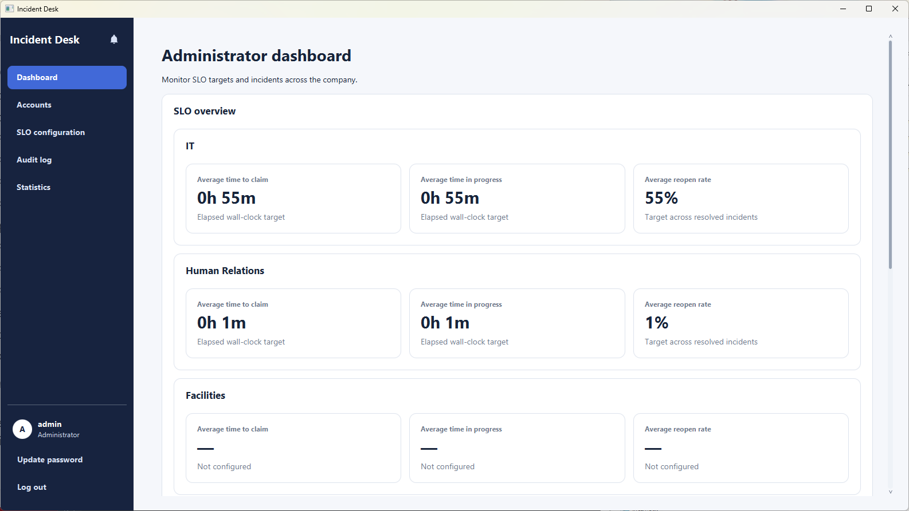

# Incident Desk

<b>Incident Desk is a desktop application for reporting and managing
company incidents.</b> Reporters can submit and track incidents, responders can
handle incidents in their assigned categories, and administrators can manage
access, service-level objectives, statistics, and audit records.

## Documentation

- If you are interested in using Incident Desk, head over to the <b>[User Guide](UserGuide.md)</b>.
- If you are peer reviewing Incident Desk as part of CS3227, you can visit <b>[Peer Review Guide](PeerReviewGuide.md)</b>.
- If you are interested in contributing to the development of Incident Desk, the <b>[Developer Guide](DeveloperGuide.md)</b> is a good place to start.
- To view our insights into using AI agents to develop Incident Desk, look towards <b>[Reflections](Reflections.md)</b>.
